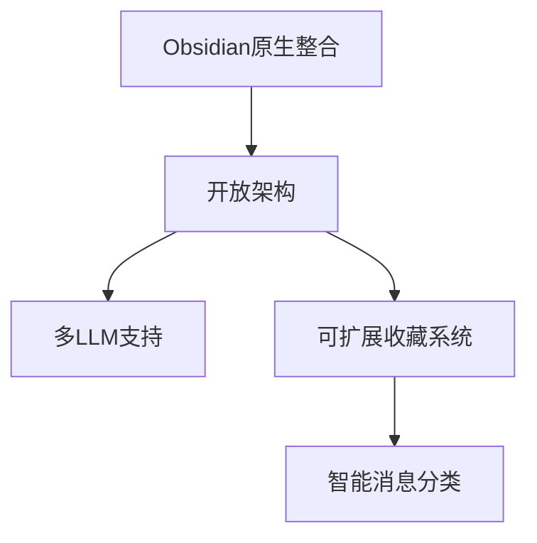

# Obsidian React Iris


## 🌟 核心特性

### LLM 零基础入门
- [x] 只需知道 API URL 即可使用 OpenAI 等主流服务  
`<gif: quick-connect-demo>`
- [x] 为 Obsidian 用户定制的学习路径  
``
- [x] 详细的逐步引导教程  
``

### 📂 本地优先的笔记掌控
```markdown
- [x] 原生支持 Markdown/JSON/Canvas
- [x] 本地运行支持 (Ollama/LM Studio)
- [x] 内置文档查看器 ``
```

### ⚙️ 透明可控的AI交互
| 功能 | 描述 |
|------|------|
| 服务开关 | 自由启用/禁用在线服务 `<gif: service-toggle>` |
| 文件追踪 | 实时显示数据存储位置 `` |
| 执行日志 | 完整记录LLM操作过程 `` |

## 🛠️ 快速开始
```bash
npm install
npm run dev
```
``

## 🌈 设计理念

`<gif: workflow-demo>`

## 📚 技术优势
- 使用 Obsidian 原生 Styles CSS 变量  
``
- 基于 Obsidian API 的智能工具集  
``
- 响应式侧边栏设计  
`<gif: responsive-sidebar>`

## 🤝 开源承诺
```diff
+ 永久免费的核心功能
! 未来可能增加增值服务
- 绝不隐藏任何核心功能
```

ℹ️ 完整文档请查看 [开发者指南](docs/developer.md)